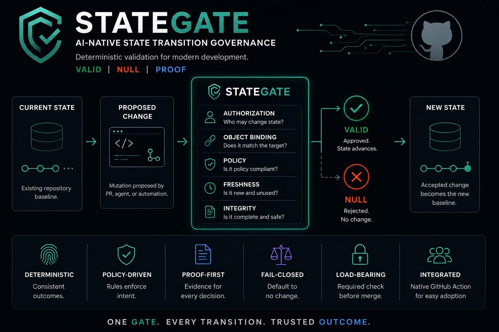

# StateGate

Govern repository state transitions.

VALID | NULL | PROOF

StateGate validates whether the exact proposed pull-request mutation remains authorized, policy-compliant, current, and eligible to become canonical repository state.

<p align="center">
  
</p>


## Scope

StateGate currently operates through GitHub pull requests and merge eligibility. It deterministically evaluates the proposed repository mutation represented by a pull request against the current repository state inputs supplied to the action. It does not claim to govern arbitrary databases, deployments, terminals, or external systems.

## State-transition model

```text
Proposed pull-request mutation
↓
Current repository state inputs
+ Exact pull-request diff binding
+ Authorization and policy inputs
+ Optional review approval evidence
↓
Canonicalization
↓
VALID | NULL
↓
PROOF
↓
GitHub merge-eligibility status check
```

## Governance vocabulary

- `VALID` → the proposed repository mutation is eligible to become canonical repository state for the evaluated policy inputs.
- `NULL` → eligibility is not established; fail closed.
- `PROOF` → deterministic evidence for the exact object binding and validation result.

## Repository Boundary

This action owns:

- canonical pull-request identity normalization
- exact pull-request diff binding
- explicit authorization and policy validation
- freshness checks for evaluated head/base SHAs
- integrity hashing
- proof emission
- GitHub status reporting

This action does not own:

- code review quality judgments
- security analysis
- CI validation
- repository approval policy definition
- runtime governance outside the GitHub pull-request execution surface
- final merge authorization

Final merge decisions remain the responsibility of GitHub branch protection and repository policy.

## What this proves

StateGate proves the PR identity object, exact canonical diff, explicit policy scope, diff provenance, normalized attribution evidence, and when enabled normalized review evidence are complete, canonicalized, hashed, and proof-bound before state-transition eligibility is reported:

```text
validated_object == emitted_proof_object
validated_diff == diff_bound_to_validated_head_sha
```

Boundary statements:

- Diff binding proves which textual patch was evaluated. It does not prove that the patch is correct or safe.
- When review binding is enabled, StateGate can verify that normalized review evidence was bound to the validated head SHA: `reviewed_head_sha == validated_head_sha`.
- StateGate does not determine whether reviewed code is correct or safe, and it does not replace CODEOWNERS, required reviewers, branch protection, GitHub review dismissal settings, or GitHub merge authority.
- The action does not classify humans or agents from hidden platform authority.
- The action does not bind the final merge commit.
- It is a deterministic state-transition eligibility validator for GitHub pull requests, not a semantic code-review engine or final merge authority.

## Installation

Choose the pinning form that matches your reproducibility requirement:

```text
@v1
→ latest compatible v1 release
@v1.0.0
→ immutable exact release
@commit-sha
→ immutable validator source
```

The Continufy StateGate Marketplace convenience channel uses the moving `v1` tag:

```yaml
name: StateGate

on:
  pull_request:
    types: [opened, synchronize, reopened]

jobs:
  stategate:
    runs-on: ubuntu-latest
    steps:
      - uses: joselunasrt8-creator/stategate@v1
        id: stategate
        with:
          repo: ${{ github.repository }}
          pr-number: ${{ github.event.pull_request.number }}
          head-sha: ${{ github.event.pull_request.head.sha }}
          base-sha: ${{ github.event.pull_request.base.sha }}
          actor: ${{ github.event.pull_request.user.login }}
```

When `pr-diff` is omitted, the action fetches the pull request JSON and GitHub diff for the supplied `repo`, `pr-number`, `base-sha`, and `head-sha` using `github-token`. The fetched pull-request `head.sha` and `base.sha` must match the evaluated inputs or the action fails closed to `NULL`.

## Enforce as a required check

After committing the workflow, configure branch protection to require the `stategate` job before merge. The action exits non-zero for `NULL`, so GitHub branch protection can use this job directly as the load-bearing required status check.


## Migrating from Merge Guard

StateGate is the canonical product identity for the prior Merge Guard action. Update install references before the StateGate v1.0.0 Marketplace release:

- Repository: `joselunasrt8-creator/continuity-merge-guard` → `joselunasrt8-creator/stategate`
- Action reference: `uses: joselunasrt8-creator/continuity-merge-guard@v1` → `uses: joselunasrt8-creator/stategate@v1`
- Recommended workflow/check name: `merge-guard` → `stategate`

Compatibility identifiers retained for existing consumers and replay safety:

- Function/API names: `validateMergeGuard(input)` and legacy `evaluate(input)` remain stable entrypoints.
- Environment variables: `MERGE_GUARD_*` remain the action adapter contract.
- Proof identifiers and artifacts: `MERGE_GUARD-{pr_number}-{head_sha[:8]}`, `MERGE_GUARD_PROOF.json`, and `MERGE_GUARD_PROOF` remain stable for historical proof consumers.
- Canonical algorithm version: `merge-guard-v1` remains unchanged because it identifies validation semantics, not marketing identity.

These retained identifiers are compatibility aliases. New documentation should use StateGate for the product name and `joselunasrt8-creator/stategate@v1` for installation.

## Runtime

```text
Pull Request / CLI Environment / Test Fixture
        ↓
Input Acquisition
        ↓
validateMergeGuard(input)
        ↓
proofFromDecision(decision)
        ↓
MERGE_GUARD_PROOF.json + GitHub Outputs + Status Check
```

All repository-local StateGate validation entrypoints use the same canonical validation flow in `guard.mjs`. `check.mjs` is the runtime adapter: it acquires inputs, optionally fetches the GitHub diff, delegates validation to `validateMergeGuard(input)`, derives the proof with `proofFromDecision(decision)`, and exits non-zero when the canonical result is `NULL`.

## Output

Each run produces:

| Output | Description |
|--------|-------------|
| `result` | `VALID` or `NULL` |
| `proof_id` | `MERGE_GUARD-{pr_number}-{head_sha[:8]}` |
| `proof_hash` | sha256 of the canonical payload |
| `diff_hash` | sha256 of the canonical pull request diff |
| `proof_url` | path to `MERGE_GUARD_PROOF.json` |
| `author_kind` | normalized `agent`, `human`, or `unknown` author scope |
| `null_reasons` | comma-separated NULL reason codes, empty for `VALID` |
| `attribution_status` | `identity_present`, `identity_missing`, or `identity_ambiguous` |
| `attribution_classification` | `AGENT_AUTHORED`, `AGENT_ASSISTED`, `HUMAN_AUTHORED`, or `UNKNOWN` |
| `actor_kind` | normalized actor kind `human`, `agent`, `bot`, or `unknown` |
| `attribution_evidence_hash` | sha256 of the canonicalized attribution evidence |
| `review_status` | Review binding status derived from the canonical decision |
| `review_evidence_hash` | sha256 of canonical normalized review evidence when review binding is enabled |
| `approval_count` | Count of distinct latest approvals bound to the validated head SHA |

The proof is written to the job step summary and uploaded as a workflow artifact named `MERGE_GUARD_PROOF`.

## Canonical diff binding

The proof payload includes:

```json
{
  "base_sha": "...",
  "head_sha": "...",
  "diff_hash": "sha256:..."
}
```

The `diff_hash` is computed from canonical diff bytes using these deterministic normalization rules:

- input must be a non-empty Git-style unified diff containing at least one `diff --git` file header;
- CRLF and CR transport line endings are normalized to LF;
- the canonical byte stream ends with exactly one terminal LF;
- file order and hunk order are preserved exactly as received;
- patch text, paths, hunk headers, context lines, additions, deletions, mode lines, index lines, rename/copy metadata, and binary patch markers are preserved;
- no semantic equivalence is inferred between different textual patches.

StateGate fails closed to `NULL` when diff acquisition fails, the diff is missing or malformed, the fetched pull-request head/base SHA does not match the evaluated inputs, a supplied prior diff/proof hash no longer matches the current canonical object, or a post-validation object mutation is detected. Workflows can pass `expected-diff-hash`, `expected-proof-hash`, `expected-review-evidence-hash`, and `expected-validated-object-hash` when replaying or reconciling a prior proof; all four checks are enforced by the same canonical validation function. Diff provenance is intentionally bound into the proof hash: identical diff text keeps the same `diff_hash`, but different `diff_source` values produce different `proof_hash` values. Attribution is also decision-critical proof evidence; normalized attribution status, classification, and evidence hash are included in the canonical payload so changed attribution evidence changes proof identity.


## Optional review approval binding

Review approval binding is disabled by default (`require-review-approval: 'false'`) to preserve existing behavior. When enabled, callers may pass one structured `review-evidence` JSON object or allow `check.mjs` to acquire reviews from GitHub before deterministic validation. Network acquisition is outside the validation boundary; normalized evidence is then passed to `validateMergeGuard(input)`. Acquisition failure fails closed.

Minimal review evidence shape:

```json
{
  "head_sha": "...",
  "reviews": [
    {
      "reviewer": "alice",
      "state": "APPROVED",
      "submitted_at": "2026-01-01T00:00:00Z",
      "commit_id": "..."
    }
  ]
}
```

StateGate normalizes only review fields needed for legitimacy, sorts records deterministically, computes `review_evidence_hash`, and binds the review policy/result into the canonical decision when review binding is enabled. Deterministic review semantics are fail-closed: comments, reactions, labels, and heuristic metadata never count as approval; duplicate reviews by one reviewer count only the latest review; later `CHANGES_REQUESTED` supersedes approval; `DISMISSED`, stale-head, malformed, missing, conflicting, or insufficient evidence returns `NULL`. `REVIEW_APPROVAL_REQUIRED` means no qualifying current-head approval exists, and it may appear alongside `INSUFFICIENT_APPROVALS`.

Required invariant when enabled:

```text
reviewed_head_sha == validated_head_sha
```

Example:

```yaml
          require-review-approval: 'true'
          minimum-approvals: '1'
```

## Read outputs in later steps

```yaml
      - uses: joselunasrt8-creator/stategate@v1
        id: stategate
        with:
          repo: ${{ github.repository }}
          pr-number: ${{ github.event.pull_request.number }}
          head-sha: ${{ github.event.pull_request.head.sha }}
          base-sha: ${{ github.event.pull_request.base.sha }}
          actor: ${{ github.event.pull_request.user.login }}

      - name: Show proof binding
        if: always()
        run: |
          echo "result=${{ steps.stategate.outputs.result }}"
          echo "proof_hash=${{ steps.stategate.outputs.proof_hash }}"
          echo "null_reasons=${{ steps.stategate.outputs.null_reasons }}"
```

## Agent-authored required lane

For an agent-authored PR lane, make the check load-bearing by setting `require-agent-authored: 'true'` and providing the explicit `author-kind` value from the workflow policy:

```yaml
      - uses: joselunasrt8-creator/stategate@v1
        id: stategate
        with:
          repo: ${{ github.repository }}
          pr-number: ${{ github.event.pull_request.number }}
          head-sha: ${{ github.event.pull_request.head.sha }}
          base-sha: ${{ github.event.pull_request.base.sha }}
          actor: ${{ github.event.pull_request.user.login }}
          author-kind: agent
          require-agent-authored: 'true'
```

## File manifest and verification

See [`docs/ARCHITECTURE.md`](docs/ARCHITECTURE.md) for the canonical enforcement flow and sequence diagram. See [`docs/FILE_MANIFEST.md`](docs/FILE_MANIFEST.md) for the complete file manifest, intentional root-packaging adaptations, canonical source reference, and verification notes.

## Release Status

StateGate is available through the GitHub Marketplace as `Continufy StateGate`.

Repository branding remains:

- Company: Continufy
- Product: StateGate
- Marketplace Listing: Continufy StateGate

Current release channels:

- `v1` — moving major-version tag for the latest compatible v1 release
- `v1.0.0` — exact-version tag intended to remain immutable under the repository release policy
- commit SHA — immutable source pin for maximum reproducibility

Recommended installation:

```yaml
uses: joselunasrt8-creator/stategate@v1
```

For reproducible installations, pin an exact semantic version or commit SHA:

```yaml
uses: joselunasrt8-creator/stategate@v1.0.0
uses: joselunasrt8-creator/stategate@<full-commit-sha>
```

The moving `v1` tag may advance to newer backward-compatible v1 releases. Exact semantic-version tags are intended to remain immutable under the repository release policy, and commit SHAs should be treated as immutable source pins.
