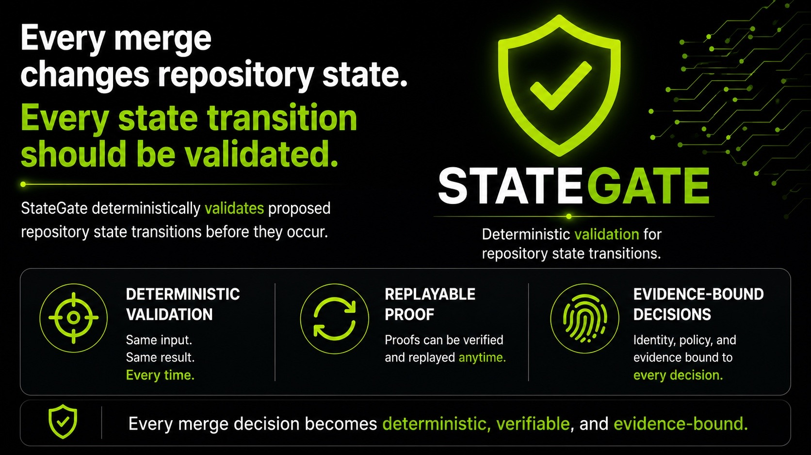
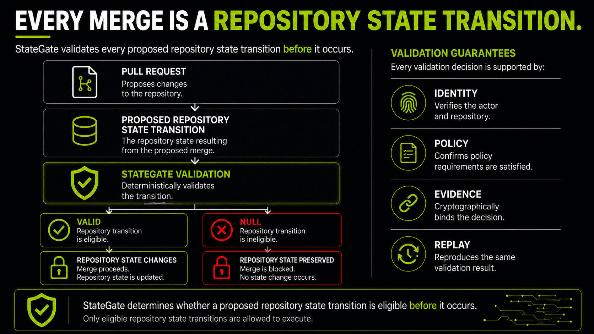
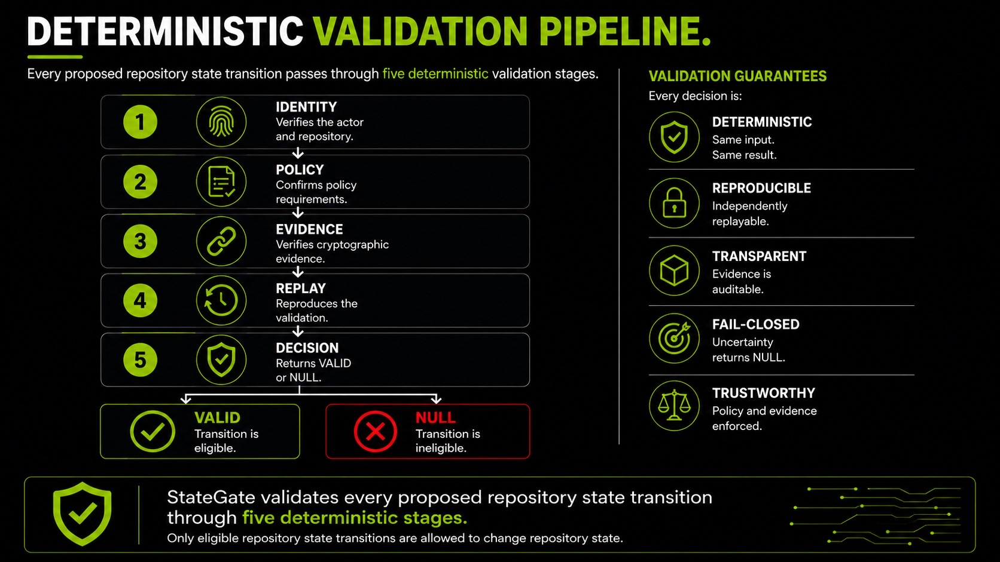
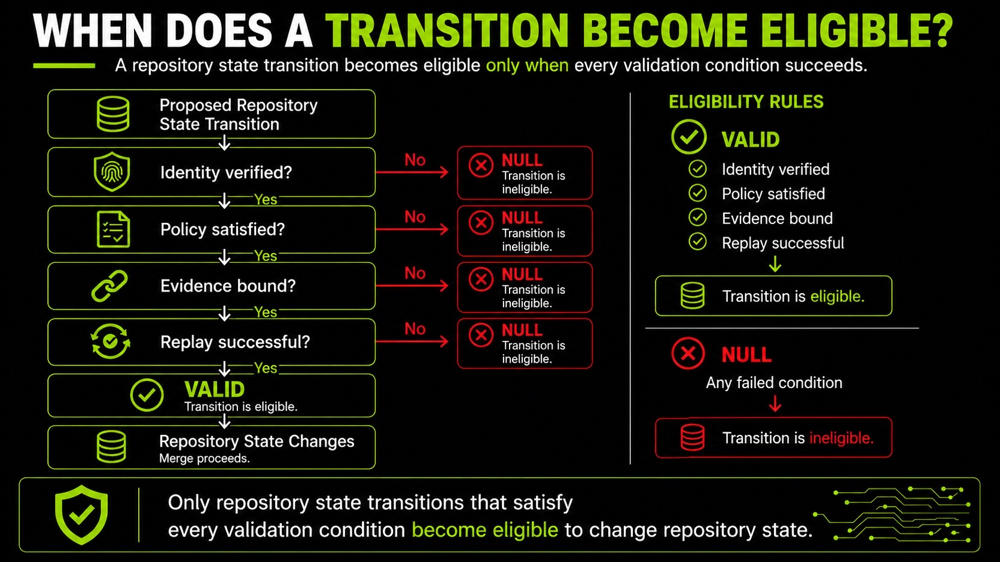
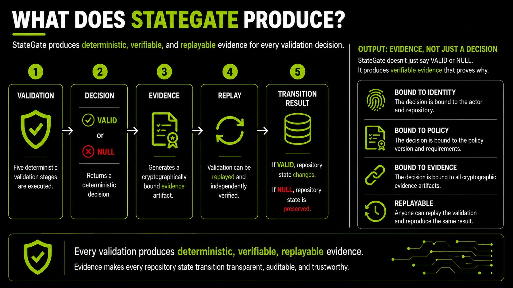

<div align="center">

</div>

# StateGate

StateGate is a deterministic GitHub Action that validates the exact pull request state before it becomes eligible to change repository state.

## Purpose

CI can test repository contents without proving which pull request state was evaluated. A review can also become stale when the head commit changes.

StateGate closes that boundary by evaluating one explicit pull request object and returning one of two results:

- `VALID` — the supplied object and enabled policies are internally consistent.
- `NULL` — required data is missing, malformed, stale, unavailable, or inconsistent.

Every action or CLI evaluation writes `MERGE_GUARD_PROOF.json`, which binds the result to the evaluated head SHA, base SHA, canonical diff, attribution evidence, and enabled review policy. StateGate fails closed: incomplete evidence produces `NULL`, not an inferred success.

## Getting Started

### Add the action

Create `.github/workflows/stategate.yml` in the consuming repository:

```yaml
name: StateGate

on:
  pull_request:
    types: [opened, synchronize, reopened]

permissions:
  contents: read
  pull-requests: read
  actions: write

jobs:
  stategate:
    name: stategate
    runs-on: ubuntu-latest
    steps:
      - name: Validate pull request state
        id: stategate
        uses: joselunasrt8-creator/stategate@v1
        with:
          repo: ${{ github.repository }}
          pr-number: ${{ github.event.pull_request.number }}
          head-sha: ${{ github.event.pull_request.head.sha }}
          base-sha: ${{ github.event.pull_request.base.sha }}
          actor: ${{ github.event.pull_request.user.login }}
```

The five inputs shown above are required. When `pr-diff` is omitted, StateGate uses `github.token` to acquire the pull request object and diff, then verifies the acquired SHAs.

`contents: read` and `pull-requests: read` support evidence acquisition. `actions: write` allows `actions/upload-artifact@v4` to upload the proof artifact.

For reproducible installations, replace the moving `@v1` reference with an exact release or full commit SHA:

```yaml
uses: joselunasrt8-creator/stategate@v1.1.1
# or
uses: joselunasrt8-creator/stategate@<full-commit-sha>
```

### Verify the repository locally

StateGate has no package-install step. With Node.js available:

```bash
node --check canonical.mjs
node --check attribution.mjs
node --check guard.mjs
node --check check.mjs
node test.mjs
```

See the maintained [consumer workflow](examples/consumer-workflow.yml) for deterministic `VALID` and bounded `NULL` examples.

## Doesn't GitHub Already Solve This?

GitHub already provides strong repository governance through branch protection, required checks, CODEOWNERS, merge queues, and repository rules.

StateGate operates at a different boundary. Rather than governing the merge workflow, it deterministically validates the exact pull request state that is eligible to mutate repository state and emits replayable proof of that decision.

## Every Merge Changes Repository State

Every merge is a repository state transition.

A pull request proposes a new repository state. Before that transition is allowed to occur, StateGate deterministically validates the complete evaluated pull request object—including identity, policy, attribution, evidence, and replay integrity—and returns either VALID or NULL.

Only validated state transitions become eligible to mutate repository state.

## Every Merge Is a Repository State Transition
<div align="center">

</div>

## Deterministic Validation Pipeline
<div align="center">

</div>

## When Does a Transition Become Eligible?
<div align="center">

</div>

## What Does StateGate Produce?
<div align="center">

</div>

## Scope

StateGate governs the state supplied to a single validation run. Its boundary includes:

- repository and pull request identity;
- head and base commit SHAs;
- canonical pull request diff bytes and provenance;
- actor and author-attribution evidence;
- optional review evidence bound to the current head SHA;
- optional expected hashes used for replay checks.

The deterministic boundary begins after external evidence has been acquired. Network retrieval is not deterministic; the acquired values and their provenance are included in the validated object.

## Overview

StateGate is a dependency-free Node.js validator packaged as a composite GitHub Action.

```text
GitHub pull request event
          |
          v
 action.yml (input adapter)
          |
          v
 check.mjs (evidence acquisition and output adapter)
          |
          v
 guard.mjs (canonical validation decision)
      /          \
     v            v
 VALID          NULL
      \          /
       v        v
  MERGE_GUARD_PROOF.json
```

`guard.mjs` is the only decision surface. The action, CLI, tests, and library exports all enter `validateMergeGuard(input)`. Canonicalization and SHA-256 hashing live in `canonical.mjs`; attribution normalization lives in `attribution.mjs`.

See [Architecture](docs/ARCHITECTURE.md) for the execution-path audit and determinism boundary.

## Core Runtime

```text
explicit inputs
    |
    +-- supplied diff/review evidence ------------------+
    |                                                   |
    +-- or GitHub API acquisition                       |
                                                        v
                                              normalize evidence
                                                        |
                                                        v
                                              validate identity
                                                        |
                                                        v
                                            canonicalize and hash
                                                        |
                                                        v
                                            evaluate enabled policy
                                                        |
                                                        v
                                             compare replay hashes
                                                        |
                                                        v
                                               VALID or NULL
                                                        |
                                                        v
                                               emit exact proof
```

The proof is projected from the canonical decision. There is no separate proof-building decision path. A `NULL` result writes the same proof format with bounded `null_reasons` and exits non-zero.

## Key Concepts

| Term | Definition |
| --- | --- |
| **Validated object** | The normalized identity, diff, attribution, policy, and review fields evaluated in one run. |
| **Canonical diff** | A normalized unified diff with deterministic line endings and terminal newline handling. |
| **Canonical hash** | SHA-256 of the canonical validated payload; also exposed as `proof_hash`. |
| **Diff hash** | SHA-256 of the canonical diff text. |
| **Proof** | `MERGE_GUARD_PROOF.json`, the serialized record projected from the decision. |
| **Replay guard** | An expected diff, proof, validated-object, or review-evidence hash that must match the current evaluation. |
| **Attribution evidence** | Explicit and heuristic signals used to classify work as agent-authored, agent-assisted, human-authored, or unknown. |
| **Review binding** | Optional validation that normalized approval evidence applies to the evaluated head SHA. |
| **`VALID`** | All required inputs and enabled policies passed. It is not a statement about code quality or merge authority. |
| **`NULL`** | Validation failed closed for one or more bounded reasons. |

Compatibility identifiers such as `MERGE_GUARD_PROOF.json`, `MERGE_GUARD_*`, and `merge-guard-v1` are intentionally retained because they are part of the replay-sensitive v1 contract.

## Responsibilities

StateGate is responsible for:

- validating required pull request identity fields;
- checking acquired head and base SHAs against the requested state;
- normalizing and hashing unified diff content deterministically;
- classifying and binding attribution evidence;
- enforcing explicit agent-authorship policy when enabled;
- normalizing review evidence and rejecting stale approvals when review binding is enabled;
- comparing optional replay hashes;
- emitting GitHub Action outputs and a proof for the exact decision;
- returning a non-zero status for `NULL`.

## Non-Responsibilities

StateGate does not:

- determine whether code is correct, secure, tested, or deployable;
- configure branch protection, repository rulesets, merge queues, or required checks;
- grant merge authority or merge a pull request;
- replace CODEOWNERS, required reviewers, CI, security scanning, or deployment controls;
- establish that an asserted human or agent identity is authentic beyond the supplied evidence;
- make GitHub API acquisition deterministic;
- provide long-term artifact retention or external evidence storage.

To make StateGate load-bearing, configure the repository to require the workflow check named `stategate` after the workflow has run at least once.

## Features

- Exact pull request identity validation.
- Deterministic JSON and diff canonicalization.
- Stable SHA-256 proof, diff, attribution, and review-evidence hashes.
- Optional proof and validated-object replay checks.
- Fail-closed GitHub diff acquisition with SHA continuity checks.
- Explicit agent-attribution policy and ambiguity detection.
- Optional approval thresholds bound to the current head SHA.
- Fixture-based conformance and release-manifest verification.
- No npm installation or compiled distribution step.

## Repository Structure

```text
.
├── action.yml            # Composite action contract and adapter
├── check.mjs             # CLI, API acquisition, proof/output emission
├── guard.mjs             # Canonical validation and proof projection
├── canonical.mjs         # Canonicalization and SHA-256 helpers
├── attribution.mjs       # Attribution evidence normalization
├── test.mjs              # Conformance test harness
├── fixtures/             # VALID, NULL, policy, and evidence cases
├── examples/             # Consumer workflow example
├── docs/                 # Architecture, operation, and release guides
├── schemas/              # External adoption evidence schema
├── scripts/              # Release and evidence verification tools
└── release/              # Versioned manifests and validator metadata
```

The complete packaging map is maintained in [File Manifest](docs/FILE_MANIFEST.md).

## Example Workflow

A typical run follows this sequence:

1. A pull request is opened or its head SHA changes.
2. The workflow passes the pull request identity to StateGate.
3. `check.mjs` acquires the current pull request JSON and diff unless exact evidence was supplied.
4. `guard.mjs` validates the identity and hashes the canonical diff.
5. If enabled, attribution and review policies are evaluated against normalized evidence.
6. StateGate writes `MERGE_GUARD_PROOF.json` and exposes `result`, `proof_id`, `proof_hash`, `diff_hash`, and policy outputs.
7. `VALID` exits successfully. `NULL` exits non-zero and reports bounded reason codes.
8. GitHub uploads the file as artifact `MERGE_GUARD_PROOF`.
9. Repository rules decide whether the `stategate` check is required for merge.

Example result boundary:

```text
same validated object + same validator semantics
                     |
                     v
          same canonical proof hash

changed SHA, diff, provenance, or enabled evidence
                     |
                     v
          changed hash or bounded NULL result
```

For approval binding, add explicit policy inputs:

```yaml
with:
  # required identity inputs omitted here for brevity
  require-review-approval: 'true'
  minimum-approvals: '1'
```

When `review-evidence` is omitted, StateGate fetches reviews and binds normalized approvals to the evaluated head SHA.

## End-to-End Validation Example

This worked example connects the lifecycle described in [Every Merge Changes Repository State](#every-merge-changes-repository-state) to the decision boundary in [Example Workflow](#example-workflow). It uses the existing action contract from [Getting Started](#getting-started) and the terms from [Key Concepts](#key-concepts), rather than restating those sections.

> **Example provenance:** `acme/payments-api`, pull request `#482`, both commit SHAs, and the patch below are illustrative. The proof and replay hashes were generated deterministically from the displayed inputs with this checkout; they are not hashes of an actual GitHub pull request. An operational record should retain the action's exact release or full-commit pin alongside the proof. That workflow pin does not by itself populate `validator_commit`; with the checked-in release manifest structure, the emitted value remains `unknown` when no `source_commit` is present.

### Pull request and policy inputs

A payments team proposes this patch at head `8b1f3e86a7db2f98858b7c7654b0a9d4b14a2e61`, based on `61af0c2b7733d4cfeb150d1c8c6cbb281f387dca`:

```diff
diff --git a/docs/deploy.md b/docs/deploy.md
index 2cbb7ad..93d8c31 100644
--- a/docs/deploy.md
+++ b/docs/deploy.md
@@ -8,2 +8,3 @@ Deployments require approval.
 - Run tests.
 - Obtain approval.
+- Record the release digest.
```

The workflow supplies the following validation boundary:

| Input group | Values |
| --- | --- |
| Repository identity | `repo=acme/payments-api`, `pr_number=482`, `actor=mira-dev` |
| Commit identity | `head_sha=8b1f3e86a7db2f98858b7c7654b0a9d4b14a2e61`, `base_sha=61af0c2b7733d4cfeb150d1c8c6cbb281f387dca` |
| Diff evidence | The unified diff above, acquired as `github_pull_request_diff_api` |
| Attribution policy | `author_kind=human`, `require_agent_authored=false` |
| Review policy | `require_review_approval=true`, `minimum_approvals=1` |
| Review evidence | `release-owner` approved the evaluated head at `2026-07-17T10:15:00Z` |
| Replay guards | On the first run, none; on replay, the recorded diff and canonical hashes |

This establishes the complete path:

```text
Pull Request
    ↓
Repository State Transition (proposed)
    ↓
StateGate Validation (identity + diff + attribution + review + replay guards)
    ↓
VALID / NULL
    ↓
MERGE_GUARD_PROOF.json
    ↓
Repository State Change (eligible after VALID) / Preserved State (NULL)
```

### Successful `VALID` transition

StateGate canonicalizes the patch, binds the policy and evidence to the repository and commit identity, and obtains this deterministic decision:

```text
result=VALID
proof_hash=7fd77993a7d04bd04b8a528738ebbd0247000cc8b93f10b92e9f984c4bff2996
diff_hash=sha256:a1610ebf7fc2c107765b9c76086f14cd1258e10b1314943e22c73ef6259c1ab2
null_reasons=[]
```

`VALID` makes this exact proposed transition *eligible* for the repository's merge controls; it does not merge the pull request or grant authority. That boundary is described in [Non-Responsibilities](#non-responsibilities).

### Example `MERGE_GUARD_PROOF.json`

The resulting evidence artifact is:

```json
{
  "proof_id": "MERGE_GUARD-482-8b1f3e86",
  "repo": "acme/payments-api",
  "validator": {
    "validator_name": "stategate",
    "validator_version": "1.1.1",
    "validator_commit": "unknown",
    "validator_release_hash": "sha256:2f660e02b8774949343a628665835d347bb0b9ac9165b4eb8bcf7d168f863fc5",
    "canonical_algorithm_version": "merge-guard-v1",
    "proof_schema_version": "1.1.0",
    "compatibility_range": ">=1.0.0 <2.0.0"
  },
  "canonical_payload": {
    "repo": "acme/payments-api",
    "pr_number": "482",
    "head_sha": "8b1f3e86a7db2f98858b7c7654b0a9d4b14a2e61",
    "base_sha": "61af0c2b7733d4cfeb150d1c8c6cbb281f387dca",
    "actor": "mira-dev",
    "diff_hash": "sha256:a1610ebf7fc2c107765b9c76086f14cd1258e10b1314943e22c73ef6259c1ab2",
    "diff_source": "github_pull_request_diff_api",
    "author_kind": "human",
    "require_agent_authored": "false",
    "attribution_status": "identity_missing",
    "attribution_classification": "UNKNOWN",
    "attribution_evidence_hash": "8edf2bd579b8879500805768d97843865a763c821757ced18421221fa275fbd8",
    "review_policy": {
      "review_required": true,
      "minimum_approvals": 1
    },
    "review_result": {
      "review_status": "approved",
      "approval_count": 1,
      "review_head_sha": "8b1f3e86a7db2f98858b7c7654b0a9d4b14a2e61",
      "review_evidence_hash": "sha256:ac84ad8005fb4ae6e5cbb2af00d1d2903e3f7e732f68f6ca199dd973aae8f3c4"
    }
  },
  "canonical_hash": "7fd77993a7d04bd04b8a528738ebbd0247000cc8b93f10b92e9f984c4bff2996",
  "diff_hash": "sha256:a1610ebf7fc2c107765b9c76086f14cd1258e10b1314943e22c73ef6259c1ab2",
  "diff_source": "github_pull_request_diff_api",
  "diff_canonicalization": "line_endings_lf_terminal_lf_preserve_order_and_patch_text",
  "result": "VALID",
  "missing_fields": [],
  "invalid_fields": [],
  "author_kind": "human",
  "require_agent_authored": "false",
  "agent_author_required": false,
  "null_reasons": [],
  "actor_attribution": {
    "actor_kind": "unknown",
    "actor_id": "mira-dev",
    "operator_id": null,
    "attribution_source": "pr_metadata",
    "confidence": "observed",
    "evidence": [
      {
        "signal_id": "github_actor_or_bot_account",
        "tier": "supporting",
        "value": "mira-dev",
        "declares": null
      }
    ]
  },
  "attribution_classification": "UNKNOWN",
  "attribution_status": "identity_missing",
  "attribution_evidence_hash": "8edf2bd579b8879500805768d97843865a763c821757ced18421221fa275fbd8",
  "review_required": true,
  "minimum_approvals": 1,
  "approval_count": 1,
  "review_evidence_hash": "sha256:ac84ad8005fb4ae6e5cbb2af00d1d2903e3f7e732f68f6ca199dd973aae8f3c4",
  "review_head_sha": "8b1f3e86a7db2f98858b7c7654b0a9d4b14a2e61",
  "review_status": "approved",
  "record_type": "MERGE_GUARD_PROOF"
}
```

Major fields have these roles:

- `proof_id` is a readable PR/head identifier; `repo` binds repository identity.
- `validator` records implementation, release, canonical algorithm, proof format, and compatibility provenance. The displayed `validator_commit` is `unknown` because the checked-in release manifest has no `source_commit`; selecting an action release or full-commit pin does not populate that field under the current manifest structure. Retain that pin alongside the proof for operational provenance.
- `canonical_payload` is the deterministically serialized object whose serialization is hashed. It binds the supplied PR identity, head and base SHAs, diff provenance, attribution, enabled policy, and normalized review result.
- `canonical_hash` (also exposed as `proof_hash`) identifies that canonical validated object; `diff_hash` independently identifies canonical patch bytes.
- `diff_source` and `diff_canonicalization` make acquisition provenance and normalization rules explicit.
- `result`, `missing_fields`, `invalid_fields`, and `null_reasons` contain the deterministic decision and bounded failure details.
- `actor_attribution` and the attribution fields preserve the signals and their classification. `identity_missing` is permitted here because agent authorship is not required.
- The review fields show that one approval was required, observed, and bound to the exact evaluated head SHA.
- `record_type` is the compatibility-preserved artifact discriminator discussed in [Migration](#migration).

### Replay verification and rejected `NULL` transition

A verifier re-runs the same validator version with the archived inputs and sets both `expected_diff_hash` and `expected_proof_hash` (or `expected_validated_object_hash`) from the artifact. Unchanged archived inputs reproduce the displayed hashes and return `VALID`.

Suppose pull request `#482` is synchronized with a new commit, `c42dff7e87b2d9200a82ad9c85511b3a83da7f22`, whose patch changes the added line to `Record and sign the release digest.`. The old replay hashes and the old approval remain archived. This is a real pull-request update model: the new head changes the proposed object, while the approval is still bound to the former head. The new canonical values are deterministic, but they no longer identify the formerly approved object:

```json
{
  "result": "NULL",
  "canonical_hash": "04a92c8f1c86b54e6df31743eaf5e25b40bd9b0db8d3c5ff579d68571fa07e75",
  "diff_hash": "sha256:630b9f9673ef78623c843626b847627eb55f7418495aa8d76fea99e3838bd40f",
  "null_reasons": [
    "DIFF_HASH_MISMATCH",
    "REVIEW_HEAD_SHA_MISMATCH",
    "PROOF_HASH_MISMATCH",
    "VALIDATED_OBJECT_MUTATION"
  ]
}
```

These replacement hashes were also generated from the illustrative synchronized update, not copied from a live pull request. The mismatch and stale approval are not repaired by inference: StateGate writes the `NULL` proof and exits non-zero. Because StateGate itself never merges and a required `stategate` check cannot pass on `NULL`, the proposed transition never becomes eligible; the base branch continues to point to its prior state. In other words, `NULL` preserves repository state by withholding transition eligibility, not by attempting a compensating mutation. See [Fail-closed boundaries](#fail-closed-boundaries) and [Scope](#scope) for the existing boundary definitions.

The artifact plus the exact validator pin, patch/evidence inputs, and expected hashes form the replay proof. Replaying the same supplied values reproduces the decision. The runtime normalizes diff line endings and terminal newline handling, policy strings, attribution evidence, and review evidence; canonical JSON serialization also fixes object-key order. Required identity fields such as `repo`, `pr_number`, `head_sha`, `base_sha`, and `actor` remain supplied values, so differently formatted identities are not claimed to be equivalent. A changed SHA, patch, provenance, policy, or bound evidence changes the canonical identity or returns a bounded `NULL`, as summarized in [Deterministic replay](#deterministic-replay).

### Lessons learned

- A displayed unified diff is evidence only when its hunk counts are valid and its bytes are the ones hashed.
- A synchronized pull-request update changes the head SHA and invalidates approval binding until current-head evidence is supplied.
- Replay claims must distinguish the fields normalized by the runtime from raw identity values preserved in the canonical payload.

## Design Principles

### One decision path

All execution surfaces use `validateMergeGuard(input)`. Compatibility exports are aliases, not parallel implementations.

### Exact-object validation

The proof is derived from the decision object. The validated fields and emitted proof fields do not pass through independent policy logic.

### Deterministic replay

Canonical serialization, normalized evidence, explicit algorithm versions, and stable hashes allow equivalent inputs to be compared across runs. Exact release or commit pins also bind validator implementation provenance.

### Fail-closed boundaries

Missing, malformed, stale, ambiguous, or mismatched required evidence produces `NULL`. Acquisition errors do not silently reduce policy requirements.

### Explicit policy

Agent-authorship and review requirements are opt-in inputs. The runtime does not infer repository governance or modify GitHub settings.

### Compatibility-aware versioning

Replay-sensitive identifiers remain stable within the v1 compatibility range. See [Versioning](docs/VERSIONING.md) and [Upgrade and Rollback](docs/UPGRADE_AND_ROLLBACK.md).

## Roadmap

Near-term work is constrained to the existing architecture:

- preserve deterministic v1 validation and replay semantics;
- expand conformance fixtures for bounded edge cases;
- strengthen release provenance and post-release verification;
- improve external consumer evidence without treating sandbox use as independent adoption;
- document compatibility-impacting changes before implementation.

Roadmap items are directional and do not change the current action contract.

## Contributing

Contributions should preserve the single canonical validation path and keep behavioral changes explicit.

1. Create a focused branch and limit the change to one bounded concern.
2. Add or update fixtures for every decision-semantic change.
3. Run syntax checks and `node test.mjs`.
4. Document compatibility and replay impact when canonical fields, reason codes, hashes, or version identifiers change.
5. Update release manifests only through the documented release process.
6. Open a pull request that describes scope, preserved invariants, validation evidence, and remaining risks.

Maintainers should also follow the [Release Checklist](docs/RELEASE_CHECKLIST.md) for release-bound changes.

## Migration

### Migrating from Merge Guard

Update the prior action reference:

```yaml
# before
uses: joselunasrt8-creator/continuity-merge-guard@v1

# after
uses: joselunasrt8-creator/stategate@v1
```

The `MERGE_GUARD_*` environment variables, `MERGE_GUARD_PROOF` artifact name, `MERGE_GUARD_PROOF.json` filename, `MERGE_GUARD-` proof ID prefix, and `merge-guard-v1` canonical algorithm identifier remain compatibility-preserved.

## Documentation

- **Install and operate:** [Consumer Checklist](docs/EXTERNAL_CONSUMER_CHECKLIST.md), [Install Verification](docs/EXTERNAL_INSTALL_VERIFICATION.md), [Upgrade and Rollback](docs/UPGRADE_AND_ROLLBACK.md)
- **Understand the runtime:** [Architecture](docs/ARCHITECTURE.md), [Versioning](docs/VERSIONING.md), [File Manifest](docs/FILE_MANIFEST.md)
- **Release:** [Release Checklist](docs/RELEASE_CHECKLIST.md), [Post-release Verification](docs/POST_RELEASE_VERIFICATION.md)
- **Evidence:** [External Adoption Protocol](docs/EXTERNAL_ADOPTION_PROTOCOL.md), [Evidence Schema](schemas/external-adoption-evidence.schema.json)

## License

Licensed under the [Apache License 2.0](LICENSE).
