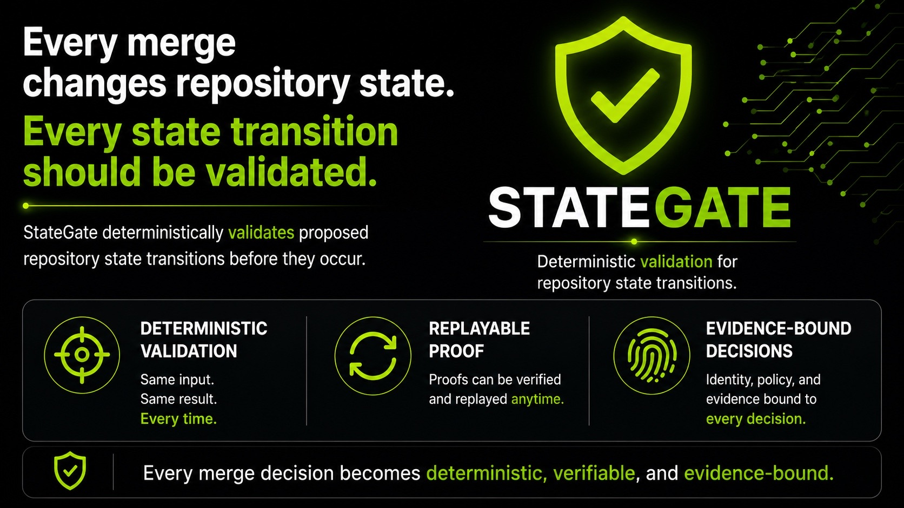

<div align="center">

</div>

# StateGate

StateGate is a deterministic GitHub Action for validating the exact pull request state before repository controls may treat that state as eligible to merge.

It is a narrow repository-state validator, not a general legitimacy runtime.

StateGate evaluates one explicit pull request object and returns exactly one of two outcomes:

- `VALID` — the supplied object and enabled policies are internally consistent.
- `NULL` — required data is missing, malformed, stale, unavailable, or inconsistent.

Every evaluation emits `MERGE_GUARD_PROOF.json`, which binds the result to the evaluated repository, pull request, head SHA, base SHA, canonical diff, attribution evidence, review evidence when enabled, policy inputs, and replay hashes.

StateGate fails closed: incomplete or stale evidence produces `NULL`, not inferred success.

## Why StateGate Exists

GitHub already provides strong governance through branch protection, required checks, CODEOWNERS, merge queues, reviews, and repository rules.

StateGate does not replace those controls.

Its narrower question is:

> What exact pull request object was evaluated, under what evidence and policy, and can that exact decision be reproduced?

```text
Pull request state
        ↓
Canonical validated object
        ↓
Deterministic policy/evidence checks
        ↓
VALID | NULL
        ↓
Replayable proof
        ↓
Repository controls decide whether merge is allowed
```

A `VALID` result is **eligibility evidence for repository controls**. It is not merge authority, code correctness, deployment approval, or a universal execution-legitimacy determination.

## Relationship to ContinuityOS

StateGate and ContinuityOS operate at different scopes.

```text
StateGate
Exact GitHub pull-request validation
One bounded repository-state transition
Stateless per-run decision surface
VALID | NULL + proof

ContinuityOS
Broader legitimacy infrastructure
Durable authority / eligibility / replay / proof / reconciliation concerns
Multiple execution surfaces
```

StateGate should therefore be understood as a **narrow GitHub-native execution-boundary wedge and evidence source**, not as a replacement for ContinuityOS and not as proof that the complete ContinuityOS legitimacy lifecycle is operational.

Likewise, ContinuityOS concepts must not be silently imported into StateGate merely to make broader lifecycle experiments pass.

## Core Invariants

```text
Validated object
≠
Merge authority
```

```text
VALID
≠
Code correctness
```

```text
VALID
≠
Execution authority
```

```text
Changed head SHA / diff / bound evidence
→ new validated object or NULL
```

```text
Missing / stale / contradictory required evidence
→ NULL
```

```text
Same validated object + same validator semantics
→ same canonical proof hash
```

## Getting Started

Create `.github/workflows/stategate.yml` in the consuming repository:

```yaml
name: StateGate

on:
  pull_request:
    types: [opened, synchronize, reopened]

permissions:
  contents: read
  pull-requests: read
  actions: write

jobs:
  stategate:
    name: stategate
    runs-on: ubuntu-latest
    steps:
      - name: Validate pull request state
        id: stategate
        uses: joselunasrt8-creator/stategate@v1
        with:
          repo: ${{ github.repository }}
          pr-number: ${{ github.event.pull_request.number }}
          head-sha: ${{ github.event.pull_request.head.sha }}
          base-sha: ${{ github.event.pull_request.base.sha }}
          actor: ${{ github.event.pull_request.user.login }}
```

For load-bearing use, pin an exact release or full commit SHA:

```yaml
uses: joselunasrt8-creator/stategate@v1.1.1
# or
uses: joselunasrt8-creator/stategate@<full-commit-sha>
```

The repository or organization must separately configure the `stategate` workflow as a required check if it is intended to become load-bearing.

## Deterministic Boundary

StateGate validates:

- repository and pull request identity;
- head and base commit SHAs;
- canonical pull request diff bytes and provenance;
- actor and author-attribution evidence;
- optional review evidence bound to the evaluated head SHA;
- enabled policy inputs;
- optional replay hashes.

Network acquisition itself is not deterministic. StateGate begins its deterministic boundary after evidence has been acquired and then includes provenance for those acquired values in the validated object.

## Runtime Shape

```text
GitHub pull request event
          ↓
 action.yml
          ↓
 check.mjs
 evidence acquisition / adapters
          ↓
 guard.mjs
 canonical decision surface
      ↙       ↘
   VALID      NULL
      ↘       ↙
 MERGE_GUARD_PROOF.json
```

`guard.mjs` is the single canonical decision path through `validateMergeGuard(input)`.

Canonicalization and SHA-256 hashing live in `canonical.mjs`; attribution normalization lives in `attribution.mjs`.

See [Architecture](docs/ARCHITECTURE.md) for the execution-path audit and determinism boundary.

## Key Concepts

| Term | Meaning |
| --- | --- |
| **Validated object** | The normalized identity, diff, attribution, policy, and review fields evaluated in one run. |
| **Canonical diff** | Normalized unified diff bytes under the v1 canonicalization rules. |
| **Canonical hash** | SHA-256 identity of the canonical validated payload. |
| **Proof** | `MERGE_GUARD_PROOF.json`, projected from the canonical decision. |
| **Replay guard** | Expected diff, proof, validated-object, or review-evidence hashes that must match the current evaluation. |
| **Review binding** | Optional proof that approval evidence applies to the exact evaluated head SHA. |
| **`VALID`** | Required inputs and enabled StateGate policies passed. |
| **`NULL`** | StateGate failed closed for one or more bounded reasons. |

Compatibility identifiers such as `MERGE_GUARD_PROOF.json`, `MERGE_GUARD_*`, and `merge-guard-v1` remain replay-sensitive v1 interfaces.

## Responsibilities

StateGate is responsible for:

- exact pull request identity validation;
- SHA continuity checks for acquired evidence;
- deterministic diff canonicalization and hashing;
- attribution normalization and policy evaluation where enabled;
- current-head review binding where enabled;
- optional replay-hash verification;
- deterministic `VALID | NULL` output;
- emitting proof for the exact decision;
- returning non-zero status for `NULL`.

## Non-Responsibilities

StateGate does **not**:

- determine whether code is correct, secure, tested, or deployable;
- grant merge authority;
- merge pull requests;
- configure branch protection or repository rulesets;
- replace CODEOWNERS, CI, security scanning, or deployment controls;
- issue durable authority objects;
- maintain lifecycle state across executions;
- provide complete duplicate-execution prevention;
- provide complete authority expiry/scope/consumption semantics;
- provide topology or reconciliation lifecycle semantics;
- establish the full ContinuityOS execution-eligibility conjunction;
- prove independent external value or economic value.

## Evidence Boundary

StateGate currently has deterministic conformance, rehearsal, and same-owner usage evidence.

These evidence classes are useful for implementation correctness and bounded workflow testing, but they must remain distinct:

```text
Deterministic conformance
≠
Independent external value
```

```text
Same-owner usage
≠
Independent adoption
```

```text
Required check installed
≠
Economic value demonstrated
```

The external economic-value protocol remains a separate experiment.

## Repository Structure

```text
.
├── action.yml            # Composite action contract and adapter
├── check.mjs             # CLI, acquisition, output adapter
├── guard.mjs             # Canonical validation and proof projection
├── canonical.mjs         # Canonicalization and SHA-256 helpers
├── attribution.mjs       # Attribution evidence normalization
├── test.mjs              # Conformance harness
├── fixtures/             # VALID, NULL, policy, and evidence cases
├── examples/             # Consumer workflow examples
├── docs/                 # Architecture, operation, evidence, and release guides
├── schemas/              # External-adoption evidence schema
├── scripts/              # Release and evidence verification tooling
└── release/              # Versioned manifests and validator metadata
```

## Local Verification

StateGate has no package-install step. With Node.js available:

```bash
node --check canonical.mjs
node --check attribution.mjs
node --check guard.mjs
node --check check.mjs
node test.mjs
```

## Design Principles

- one canonical decision path;
- exact-object validation;
- fail-closed semantics;
- deterministic canonicalization;
- replay-sensitive proof identities;
- explicit policy rather than inferred governance;
- compatibility-aware versioning;
- bounded scope rather than lifecycle expansion.

## Roadmap Boundary

Near-term work should remain constrained to the existing StateGate contract:

- preserve deterministic v1 validation and replay semantics;
- expand bounded conformance fixtures;
- strengthen release provenance;
- improve real consumer evidence;
- measure false blocks, false allows, latency, proof usefulness, and duplicated native controls;
- avoid importing broader ContinuityOS lifecycle responsibilities unless a separate ownership decision justifies them.

StateGate's strongest positive future result is not becoming a universal governance runtime. It is proving that exact-state validation adds measurable value at GitHub's repository mutation boundary.

## Migration

### Migrating from Merge Guard

```yaml
# before
uses: joselunasrt8-creator/continuity-merge-guard@v1

# after
uses: joselunasrt8-creator/stategate@v1
```

The `MERGE_GUARD_*` environment variables, artifact names, proof ID prefix, and `merge-guard-v1` canonical algorithm identifier remain compatibility-preserved.

## Documentation

- **Install and operate:** [Consumer Checklist](docs/EXTERNAL_CONSUMER_CHECKLIST.md), [Install Verification](docs/EXTERNAL_INSTALL_VERIFICATION.md), [Upgrade and Rollback](docs/UPGRADE_AND_ROLLBACK.md)
- **Understand the runtime:** [Architecture](docs/ARCHITECTURE.md), [Versioning](docs/VERSIONING.md), [File Manifest](docs/FILE_MANIFEST.md)
- **Release:** [Release Checklist](docs/RELEASE_CHECKLIST.md), [Post-release Verification](docs/POST_RELEASE_VERIFICATION.md)
- **Evidence:** [External Adoption Protocol](docs/EXTERNAL_ADOPTION_PROTOCOL.md), [Evidence Schema](schemas/external-adoption-evidence.schema.json)

## License

Licensed under the [Apache License 2.0](LICENSE).
