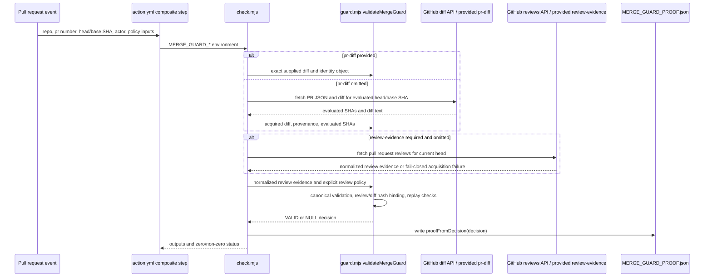

# StateGate Architecture

## Canonical enforcement flow

StateGate has one load-bearing validation surface: `validateMergeGuard(input)` in `guard.mjs`. Library callers, the local CLI, and the composite GitHub Action all enter this function before any proof or status output is produced.

```text
PR event / CLI environment / test fixture
        ↓
input acquisition
        ↓
validateMergeGuard(input)
        ├─ required identity field validation
        ├─ explicit author-policy validation
        ├─ evaluated head/base SHA continuity checks
        ├─ canonical PR diff normalization and diff hash binding
        ├─ attribution classification and evidence hash binding
        ├─ optional review evidence normalization, policy evaluation, and hash binding
        ├─ replay/proof hash comparison
        └─ canonical payload hash
        ↓
proofFromDecision(decision)
        ↓
MERGE_GUARD_PROOF.json + GitHub outputs + process exit
```

## Sequence



## Execution path audit

| Surface | Entrypoint | Canonical validation path | Bypass status |
| --- | --- | --- | --- |
| GitHub Action | `action.yml` composite `Run legitimacy check` step | `node check.mjs` → `validateMergeGuard()` | No alternate validation step is defined. |
| CLI/local smoke | `node check.mjs` | environment input acquisition → optional diff/review acquisition → `validateMergeGuard()` | Proof and exit status are derived from the canonical decision. |
| Test harness | `node test.mjs` | fixtures and regression cases call `evaluate`, which is a compatibility alias for `validateMergeGuard()` | Compatibility alias is tested against direct canonical entry. |
| Library import | `import { validateMergeGuard } from './check.mjs'` or `./guard.mjs` | both exports reference the same function | Legacy `evaluate` remains an alias, not a second implementation. |

The mutation-capable repository-local surfaces are the GitHub Action and CLI paths because they can emit proof artifacts, GitHub outputs, and process status. The test harness and library import are validation entrypoints, not independent mutation-capable execution surfaces.

## Preserved invariants

- `validated_object == emitted_proof_object` for the canonical fields written into `MERGE_GUARD_PROOF.json`.
- The decision hash binds required identity fields, normalized author policy, diff provenance, canonical diff hash, and normalized attribution status/classification/evidence hash.
- Missing, malformed, or unavailable diffs fail closed to `NULL`.
- Evaluated GitHub head/base SHAs must match the requested input SHAs.
- Optional expected diff/proof/validated-object hashes are replay guards; mismatches fail closed.
- Diff provenance is deliberately part of canonical object identity: the same textual diff has the same `diff_hash`, but a different `diff_source` produces a different proof hash.
- Attribution classification is decision-critical evidence and is bound by status, classification, and evidence hash; it can reject ambiguity but does not create hidden merge authority.
- When review binding is enabled, `reviewed_head_sha == validated_head_sha`; the decision hash binds explicit review policy, `approval_count`, `review_status`, `review_head_sha`, and `review_evidence_hash`.
- Review binding verifies normalized evidence for the current head only. It does not determine code correctness or safety and does not replace CODEOWNERS, required reviewers, branch protection, or GitHub merge authority.

## Determinism boundary

Deterministic behavior is limited to the canonical validation object, canonical diff text, and normalized review evidence. Network acquisition is intentionally outside the deterministic boundary; once acquired, the evaluated SHAs, diff bytes, diff provenance, attribution evidence, explicit review policy, and normalized review evidence are passed into the canonical flow and bound into the result.
